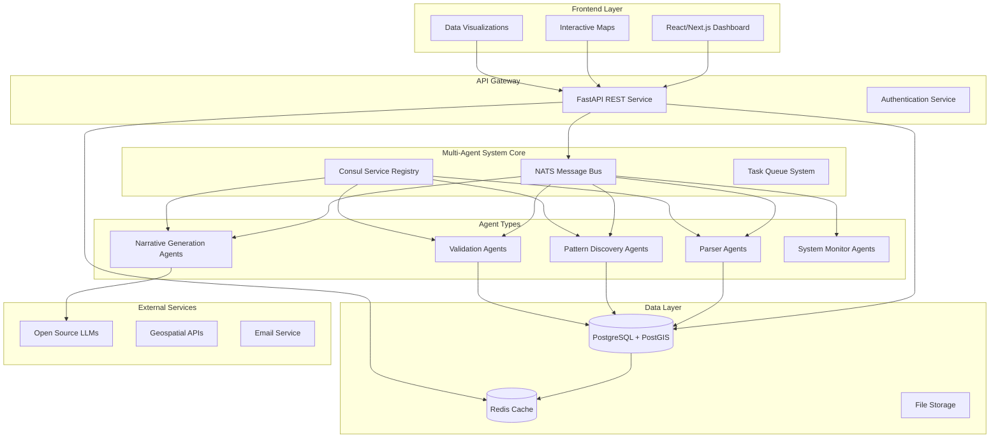
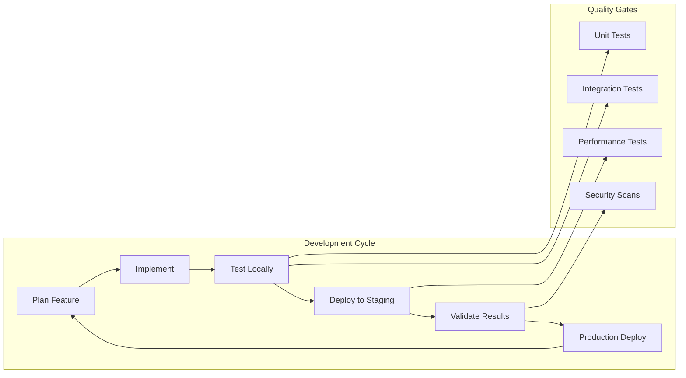

# A2A World Platform - Strategic Implementation Plan

## Executive Summary

This strategy outlines building the A2A World platform as described in the comprehensive analysis document, adapted for a solo developer with a $1K-5K budget over 18 months. The approach prioritizes open-source technologies, incremental development, and cost-effective cloud infrastructure while maintaining the scientific rigor and ambitious vision of the original concept.

## System Architecture Overview

## Technology Stack (Budget-Optimized)

### Core Infrastructure ($50-100/month)
- **Cloud Provider**: DigitalOcean or Hetzner (cost-effective)
- **Database**: PostgreSQL with PostGIS extension
- **Message Bus**: NATS (open-source, lightweight)
- **Service Discovery**: Consul (open-source)
- **Caching**: Redis (open-source)
- **Monitoring**: Prometheus + Grafana (open-source)

### Development Stack
- **Backend**: Python with FastAPI
- **Frontend**: React with Next.js
- **Agent Framework**: Custom Python agents using asyncio
- **ML/AI**: scikit-learn, HDBSCAN, sentence-transformers
- **Geospatial**: PostGIS, Shapely, GeoPandas
- **LLMs**: Ollama (local), Hugging Face Transformers

### Key Cost Optimizations
- Use local LLM inference (Ollama) instead of API calls
- Implement efficient caching to reduce compute costs
- Use object storage for large files instead of database BLOBs
- Optimize agent scheduling to minimize idle resources

## Implementation Phases

### Phase 1: Foundation (Months 1-3)
Focus on core infrastructure and basic multi-agent framework.

**Key Deliverables:**
- Working multi-agent system with NATS messaging
- PostgreSQL + PostGIS database with basic schemas
- Simple web dashboard for system monitoring
- CI/CD pipeline for automated deployment

### Phase 2: Data Ingestion (Months 4-6)
Build robust data processing and basic pattern discovery.

**Key Deliverables:**
- KML/GeoJSON parsing agents
- Basic HDBSCAN clustering implementation
- Simple pattern validation framework
- Interactive map visualization

### Phase 3: Pattern Discovery (Months 7-9)
Implement core scientific validation and explanation systems.

**Key Deliverables:**
- Statistical validation framework (Moran's I, p-values)
- Peer-to-peer consensus mechanism
- Basic narrative generation using local LLMs
- Pattern exploration dashboard

### Phase 4: Advanced Features (Months 10-12)
Add multi-modal analysis and cultural relevance scoring.

**Key Deliverables:**
- Text analysis for cultural/mythological data
- Multi-layered validation framework
- Advanced visualizations
- Email notification system (@a2aworld.ai)

### Phase 5: Optimization (Months 13-15)
Focus on performance, scalability, and user experience.

**Key Deliverables:**
- Performance optimization and caching
- Monitoring and alerting systems
- API documentation and developer tools
- Advanced conflict resolution

### Phase 6: Launch (Months 16-18)
Prepare for public release and plan future development.

**Key Deliverables:**
- Comprehensive testing and security audit
- User documentation and onboarding
- Production monitoring and backup systems
- Beta launch and community feedback

## Development Workflow

## Risk Mitigation Strategies

### Technical Risks
- **Agent Complexity**: Start with simple agents, add sophistication gradually
- **Performance**: Implement caching early, optimize continuously
- **Data Quality**: Build validation into every ingestion step
- **Scaling**: Design for horizontal scaling from the start

### Resource Risks
- **Time Management**: Work in focused 2-week sprints
- **Budget Overrun**: Monitor costs weekly, implement auto-scaling limits
- **Technical Debt**: Allocate 20% of time to refactoring and optimization

### Market Risks
- **User Adoption**: Build MVP quickly, gather feedback early
- **Competition**: Focus on unique multi-modal pattern discovery
- **Technology Changes**: Use stable, well-supported technologies

## Success Metrics

### Technical KPIs
- Agent system uptime > 99%
- Pattern discovery accuracy > 85%
- API response time < 500ms
- Data processing throughput > 1000 records/minute

### User Experience KPIs
- Dashboard load time < 3 seconds
- Pattern explanation comprehensibility score > 4/5
- User engagement time > 10 minutes per session
- Export success rate > 95%

### Business KPIs
- Monthly infrastructure costs < $200
- User retention rate > 60%
- Community contributions > 10 datasets/month
- Academic citations > 5 papers/year

## Budget Breakdown (18 Months)

| Category | Monthly | Total | Notes |
|----------|---------|-------|-------|
| Cloud Infrastructure | $75 | $1,350 | DigitalOcean droplets, storage |
| Domain & Email | $10 | $180 | a2aworld.ai domain, email service |
| Development Tools | $25 | $450 | IDEs, monitoring tools, backups |
| Marketing/Community | $20 | $360 | Content creation, community building |
| **Total** | **$130** | **$2,340** | Well within $5K budget |

## Contingency Planning

### Plan B: Reduced Scope
If development takes longer than expected:
- Delay advanced AI features to Phase 2
- Focus on core pattern discovery only
- Simplify validation framework
- Use basic visualizations initially

### Plan C: Community Development
If resources become constrained:
- Open source the platform early
- Seek academic partnerships
- Apply for research grants
- Build contributor community

## Next Steps

1. Review and approve this strategic plan
2. Set up development environment and repository
3. Begin Phase 1 implementation
4. Establish weekly progress reviews
5. Create detailed technical specifications for core components
